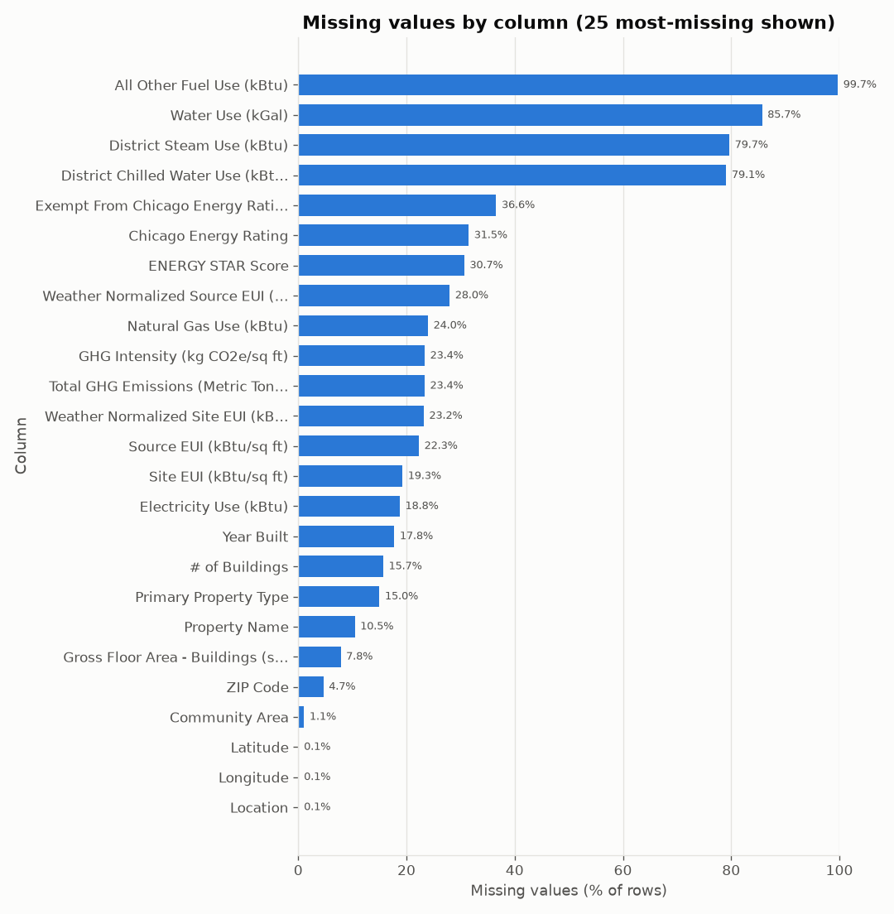
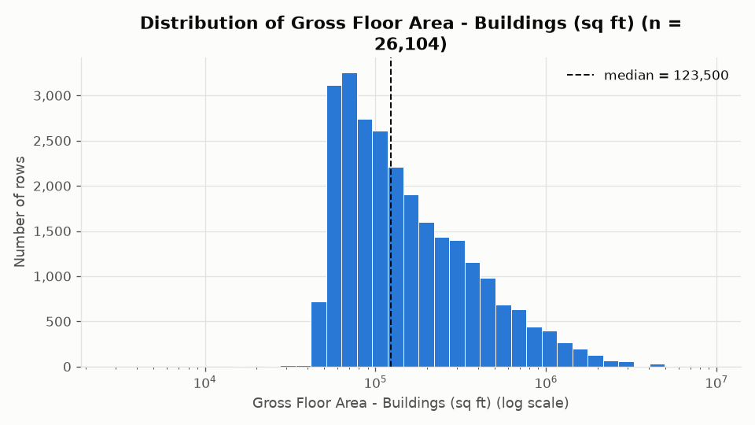
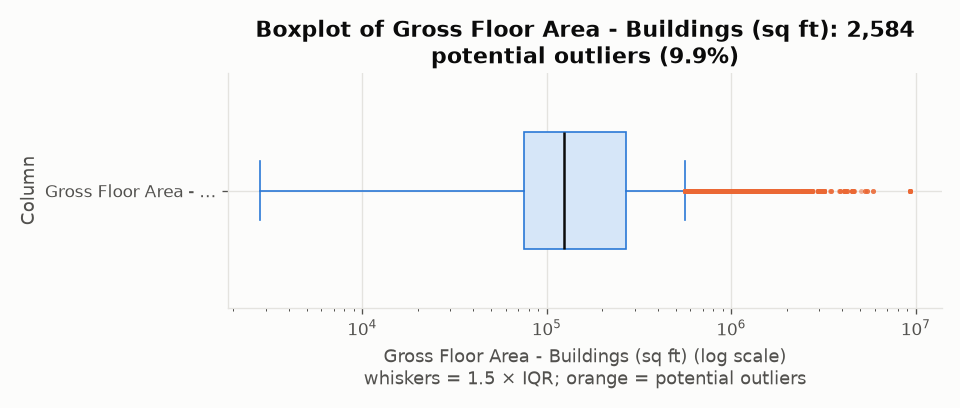
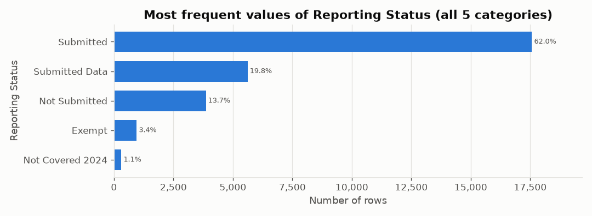
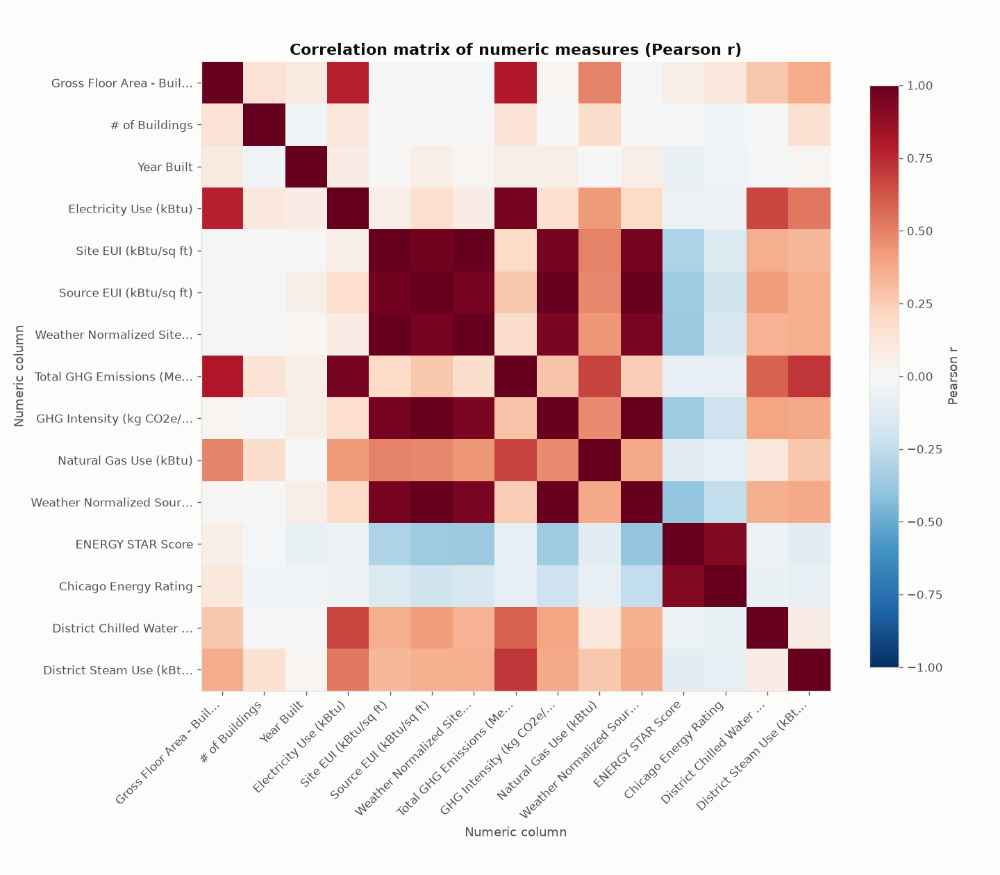
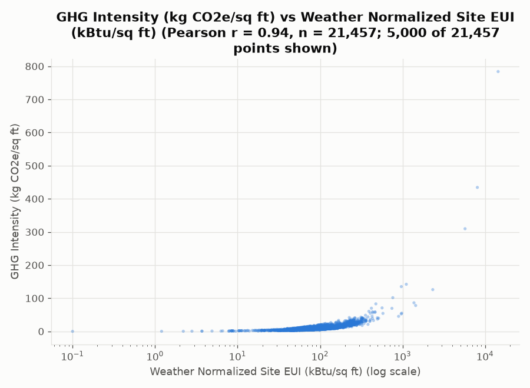
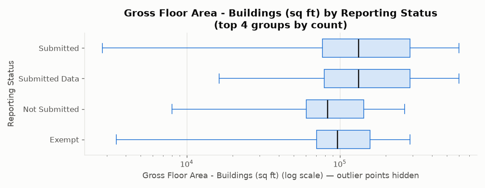
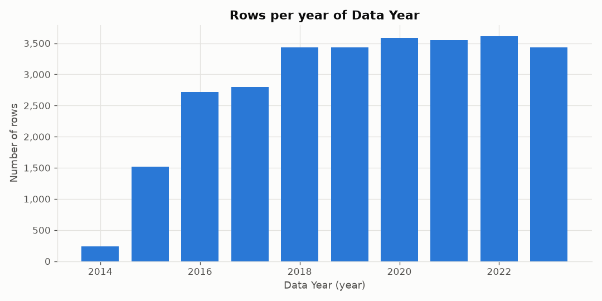

# Automated Data Profile: `chicago_energy_benchmarking.csv`

*Generated by `profiler.py` on 2026-09-25 18:57:01. All statistics were computed in Python (pandas/NumPy); the language model only explains them.*

**AI narrative:** generated with local Ollama model `qwen2.5:7b`; 6 of 6 model insights passed Python verification.

## 1. Dataset overview

- **File:** `chicago_energy_benchmarking.csv`
- **Rows:** 28,329
- **Columns:** 30
- **Column roles:** Numeric measure (19), Categorical attribute (6), Identifier-like field (3), Date-like field (1), Boolean field (1)

| Column | Technical type | Probable role | Non-missing | Missing % | Unique | Notes |
|---|---|---|---|---|---|---|
| Data Year | integer | Date-like field | 28,329 | 0.0% | 10 | integer years (name contains a year word and values are 1800-2100) |
| ID | integer | Identifier-like field | 28,329 | 0.0% | 3852 | numeric code: column name suggests an identifier/code, so it is not treated as a measurement |
| Property Name | string | Categorical attribute | 25,366 | 10.46% | 7043 |  |
| Reporting Status | string | Categorical attribute | 28,329 | 0.0% | 5 |  |
| Address | string | Categorical attribute | 28,329 | 0.0% | 7725 |  |
| ZIP Code | integer | Identifier-like field | 27,008 | 4.66% | 108 | numeric code: column name suggests an identifier/code, so it is not treated as a measurement; 81 non-numeric value(s) excluded from numeric statistics |
| Chicago Energy Rating | float | Numeric measure | 19,406 | 31.5% | 8 | only 8 distinct values - may be a coded category or rating |
| Exempt From Chicago Energy Rating | boolean | Boolean field | 17,966 | 36.58% | 2 |  |
| Community Area | string | Categorical attribute | 28,021 | 1.09% | 157 |  |
| Primary Property Type | string | Categorical attribute | 24,075 | 15.02% | 62 |  |
| Gross Floor Area - Buildings (sq ft) | integer | Numeric measure | 26,104 | 7.85% | 5852 |  |
| Year Built | integer | Numeric measure | 23,297 | 17.76% | 154 |  |
| # of Buildings | integer | Numeric measure | 23,875 | 15.72% | 37 |  |
| Water Use (kGal) | integer | Numeric measure | 4049 | 85.71% | 3328 |  |
| ENERGY STAR Score | integer | Numeric measure | 19,637 | 30.68% | 100 |  |
| Electricity Use (kBtu) | float | Numeric measure | 23,013 | 18.77% | 22,856 |  |
| Natural Gas Use (kBtu) | float | Numeric measure | 21,535 | 23.98% | 20,956 |  |
| District Steam Use (kBtu) | float | Numeric measure | 5760 | 79.67% | 595 |  |
| District Chilled Water Use (kBtu) | integer | Numeric measure | 5922 | 79.1% | 820 |  |
| All Other Fuel Use (kBtu) | float | Numeric measure | 82 | 99.71% | 69 |  |
| Site EUI (kBtu/sq ft) | float | Numeric measure | 22,870 | 19.27% | 2645 |  |
| Source EUI (kBtu/sq ft) | float | Numeric measure | 22,011 | 22.3% | 3950 |  |
| Weather Normalized Site EUI (kBtu/sq ft) | float | Numeric measure | 21,760 | 23.19% | 2634 |  |
| Weather Normalized Source EUI (kBtu/sq ft) | float | Numeric measure | 20,400 | 27.99% | 3806 |  |
| Total GHG Emissions (Metric Tons CO2e) | float | Numeric measure | 21,714 | 23.35% | 15,534 |  |
| GHG Intensity (kg CO2e/sq ft) | float | Numeric measure | 21,709 | 23.37% | 735 |  |
| Latitude | float | Numeric measure | 28,314 | 0.05% | 9483 | looks like a geographic coordinate - summarized, but excluded from correlations and headline plots |
| Longitude | float | Numeric measure | 28,314 | 0.05% | 9477 | looks like a geographic coordinate - summarized, but excluded from correlations and headline plots |
| Location | string | Categorical attribute | 28,314 | 0.05% | 9604 |  |
| Row_ID | string | Identifier-like field | 28,329 | 0.0% | 28,329 | text values that are (nearly) all distinct or named like an identifier |

*Roles are structural guesses (parse rates, cardinality, text length, generic name hints). The profiler does not know what any column means, its units, or its valid range.*

## 2. Data quality profile

- **Duplicate rows:** 0 (0.0%)
- **Missing cells:** 197,703 (23.26% of all cells); rows with any missing value: 28,329 (100.0%)
- **Constant columns (one distinct value):** none
- **Completely empty columns:** none
- **High-missingness threshold:** 30% of rows

| Column above threshold | Missing | Missing % |
|---|---|---|
| All Other Fuel Use (kBtu) | 28,247 | 99.71% |
| Water Use (kGal) | 24,280 | 85.71% |
| District Steam Use (kBtu) | 22,569 | 79.67% |
| District Chilled Water Use (kBtu) | 22,407 | 79.1% |
| Exempt From Chicago Energy Rating | 10,363 | 36.58% |
| Chicago Energy Rating | 8923 | 31.5% |
| ENERGY STAR Score | 8692 | 30.68% |

**Mixed / inconsistent types**

| Column | Inferred type | Non-conforming values | % of non-missing | Examples |
|---|---|---|---|---|
| ZIP Code | integer | 81 | 0.3% | 60626-1864, 60602-3902, 60609-1749, 60639-449, 60604-3589 |

**Identifier-like or high-cardinality columns**

| Column | Role | Unique values | Unique / non-missing |
|---|---|---|---|
| ID | Identifier-like field | 3852 | 0.136 |
| Property Name | Categorical attribute | 7043 | 0.2777 |
| Address | Categorical attribute | 7725 | 0.2727 |
| ZIP Code | Identifier-like field | 108 | 0.004 |
| Community Area | Categorical attribute | 157 | 0.0056 |
| Primary Property Type | Categorical attribute | 62 | 0.0026 |
| Location | Categorical attribute | 9604 | 0.3392 |
| Row_ID | Identifier-like field | 28,329 | 1.0 |

**Possible placeholder values** (text such as `unknown`, `N/A`, `-999` that may mean missing; *not* converted)

| Column | Count | % of rows | Values |
|---|---|---|---|
| Property Name | 10 | 0.04% | - (10) |
| Primary Property Type | 6 | 0.02% | not available (6) |

**Potentially sensitive fields (heuristic)**

| Column | Why flagged |
|---|---|
| Property Name | person or entity name |
| Address | street address |
| ZIP Code | postal code |
| Latitude | precise location |
| Longitude | precise location |
| Location | location |

> ⚠️ Sensitive-field detection is a heuristic based on column names and a few value patterns. The absence of a warning does **not** mean the dataset is free of personal or sensitive information.

> Nothing was deleted, imputed or corrected: duplicates, missing values and outliers are flagged only.

## 3. Descriptive statistics

### 3.1 Numeric columns

| Column | Valid | Missing | Min | Max | Mean | Median | Mode | Std | Q1 | Q3 | IQR | Outliers (1.5×IQR) |
|---|---|---|---|---|---|---|---|---|---|---|---|---|
| Chicago Energy Rating | 19,406 | 8923 (31.5%) | 0 | 4 | 2.215 | 2.5 | 4 (×5186) | 1.527 | 1 | 4 | 3 | 0 (0.0%) |
| Gross Floor Area - Buildings (sq ft) | 26,104 | 2225 (7.85%) | 2804 | 9,245,333 | 254,897 | 123,500 | 50,000 (×248) | 415,487 | 74,890 | 269,400 | 194,510 | 2584 (9.9%) |
| Year Built | 23,297 | 5032 (17.76%) | 1692 | 2023 | 1964.3 | 1970 | 1928 (×481) | 37.38 | 1928 | 2000 | 72 | 3 (0.01%) |
| # of Buildings | 23,875 | 4454 (15.72%) | 0 | 236 | 1.428 | 1 | 1 (×21,793) | 4.968 | 1 | 1 | 0 | 2082 (8.72%) |
| Water Use (kGal) | 4049 | 24,280 (85.71%) | 0 | 37,878,933 | 21,391 | 3326 | — | 628,181 | 1320 | 7381 | 6061 | 364 (8.99%) |
| ENERGY STAR Score | 19,637 | 8692 (30.68%) | 1 | 100 | 58.77 | 62 | 100 (×439) | 27.31 | 38 | 82 | 44 | 0 (0.0%) |
| Electricity Use (kBtu) | 23,013 | 5316 (18.77%) | 0 | 1,114,458,041 | 10,935,099 | 3,987,424 | — | 29,110,158 | 1,839,088 | 9,632,110 | 7,793,022 | 2372 (10.31%) |
| Natural Gas Use (kBtu) | 21,535 | 6794 (23.98%) | -4,774,718 | 1,642,941,217 | 12,280,105 | 5,876,568 | — | 32,402,698 | 3,240,684 | 12,329,065 | 9,088,381 | 1996 (9.27%) |
| District Steam Use (kBtu) | 5760 | 22,569 (79.67%) | -17,148,502 | 804,899,286 | 2,896,798 | 0 | 0 (×5161) | 24,208,899 | 0 | 0 | 0 | 599 (10.4%) |
| District Chilled Water Use (kBtu) | 5922 | 22,407 (79.1%) | -1,383,204 | 455,641,579 | 2,520,854 | 0 | 0 (×5101) | 14,710,499 | 0 | 0 | 0 | 821 (13.86%) |
| All Other Fuel Use (kBtu) | 82 | 28,247 (99.71%) | 3450 | 20,981,795 | 1,284,665 | 68,993 | — | 3,415,031 | 31,485 | 132,584 | 101,098 | 16 (19.51%) |
| Site EUI (kBtu/sq ft) | 22,870 | 5459 (19.27%) | 0.1 | 15,634 | 96.7 | 78.4 | 76 (×51) | 222 | 60.5 | 100.9 | 40.4 | 1679 (7.34%) |
| Source EUI (kBtu/sq ft) | 22,011 | 6318 (22.3%) | 0.2 | 16,485 | 171.3 | 136.8 | 142.5 (×32) | 260.4 | 106.6 | 181.5 | 74.9 | 1746 (7.93%) |
| Weather Normalized Site EUI (kBtu/sq ft) | 21,760 | 6569 (23.19%) | 0.1 | 14,393 | 98.85 | 82 | 65.5 (×44) | 194.8 | 63 | 104.8 | 41.8 | 1572 (7.22%) |
| Weather Normalized Source EUI (kBtu/sq ft) | 20,400 | 7929 (27.99%) | 0.2 | 11,802 | 172 | 140.7 | 141.5 (×29) | 209.6 | 110.5 | 184.7 | 74.2 | 1559 (7.64%) |
| Total GHG Emissions (Metric Tons CO2e) | 21,714 | 6615 (23.35%) | 0 | 185,162 | 2492.6 | 1026.2 | — | 5995.2 | 546.5 | 2292.5 | 1746.0 | 2240 (10.32%) |
| GHG Intensity (kg CO2e/sq ft) | 21,709 | 6620 (23.37%) | 0 | 834.9 | 9.296 | 7.3 | 5.7 (×357) | 13.64 | 5.6 | 10 | 4.4 | 1666 (7.67%) |
| Latitude | 28,314 | 15 (0.05%) | 32.95 | 42.02 | 41.88 | 41.89 | 41.94 (×389) | 0.08843 | 41.85 | 41.92 | 0.07125 | 1263 (4.46%) |
| Longitude | 28,314 | 15 (0.05%) | -96.73 | -87.53 | -87.65 | -87.64 | -87.66 (×389) | 0.08128 | -87.67 | -87.63 | 0.04161 | 2384 (8.42%) |

*Std is the sample standard deviation (ddof = 1). Quartiles use linear interpolation. Outliers are values below Q1 − 1.5×IQR or above Q3 + 1.5×IQR; they are potential outliers to review, not errors, and were not removed. Mode is shown only when a value repeats and most values are not unique.*

**Columns where 30% or more of values are exactly 0** (could be real zeros or placeholders): `District Steam Use (kBtu)`: 5161 zeros (89.6%); `District Chilled Water Use (kBtu)`: 5101 zeros (86.14%)

### 3.2 Categorical and Boolean columns

**`Property Name`** (Categorical attribute) — 7043 distinct values, 25,366 non-missing, 10.46% missing. Most frequent: Sullivan Center (14 rows).

| Value | Count | % of non-missing |
|---|---|---|
| Sullivan Center | 14 | 0.06% |
| West Side Realty Corporation | 12 | 0.05% |
| Inland Steel Building | 10 | 0.04% |
| Congress Center | 10 | 0.04% |
| Aon Center | 10 | 0.04% |
| Cook County Building | 10 | 0.04% |
| AMA Plaza | 10 | 0.04% |
| Brompton | 10 | 0.04% |
| 161 North Clark | 10 | 0.04% |
| 155 North Wacker | 10 | 0.04% |
| (all other 7033 values) | 25,260 | 99.58% |

**`Reporting Status`** (Categorical attribute) — 5 distinct values, 28,329 non-missing, 0.0% missing. Most frequent: Submitted (17,572 rows).

| Value | Count | % of non-missing |
|---|---|---|
| Submitted | 17,572 | 62.03% |
| Submitted Data | 5621 | 19.84% |
| Not Submitted | 3867 | 13.65% |
| Exempt | 957 | 3.38% |
| Not Covered 2024 | 312 | 1.1% |

**`Address`** (Categorical attribute) — 7725 distinct values, 28,329 non-missing, 0.0% missing. Most frequent: 7601 S Cicero Ave (13 rows).

| Value | Count | % of non-missing |
|---|---|---|
| 7601 S Cicero Ave | 13 | 0.05% |
| 1100 East 57th Street | 11 | 0.04% |
| 225 E Chicago Ave | 10 | 0.04% |
| 1744 W Pryor Ave | 10 | 0.04% |
| 4140 N Marine Dr | 10 | 0.04% |
| 6325 W 56th St | 10 | 0.04% |
| 600 E Grand Ave | 10 | 0.04% |
| 5015 S Blackstone Ave | 10 | 0.04% |
| 4136 S California Ave | 10 | 0.04% |
| 710 N Fairbanks Ct | 10 | 0.04% |
| (all other 7715 values) | 28,225 | 99.63% |

**`Exempt From Chicago Energy Rating`** (Boolean field) — 2 distinct values, 17,966 non-missing, 36.58% missing. Most frequent: FALSE (16,324 rows).

| Value | Count | % of non-missing |
|---|---|---|
| FALSE | 16,324 | 90.86% |
| TRUE | 1642 | 9.14% |

**`Community Area`** (Categorical attribute) — 157 distinct values, 28,021 non-missing, 1.09% missing. Most frequent: NEAR NORTH SIDE (3746 rows).

| Value | Count | % of non-missing |
|---|---|---|
| NEAR NORTH SIDE | 3746 | 13.37% |
| LOOP | 2670 | 9.53% |
| NEAR WEST SIDE | 1821 | 6.5% |
| LAKE VIEW | 1274 | 4.55% |
| LINCOLN PARK | 990 | 3.53% |
| HYDE PARK | 813 | 2.9% |
| Near North Side | 810 | 2.89% |
| UPTOWN | 760 | 2.71% |
| EDGEWATER | 685 | 2.44% |
| NEAR SOUTH SIDE | 629 | 2.24% |
| (all other 147 values) | 13,823 | 49.33% |

**`Primary Property Type`** (Categorical attribute) — 62 distinct values, 24,075 non-missing, 15.02% missing. Most frequent: Multifamily Housing (11,278 rows).

| Value | Count | % of non-missing |
|---|---|---|
| Multifamily Housing | 11,278 | 46.85% |
| K-12 School | 3503 | 14.55% |
| Office | 3214 | 13.35% |
| College/University | 796 | 3.31% |
| Hotel | 682 | 2.83% |
| Retail Store | 447 | 1.86% |
| Supermarket/Grocery Store | 404 | 1.68% |
| Residential | 327 | 1.36% |
| Mixed Use Property | 309 | 1.28% |
| Senior Care Community | 282 | 1.17% |
| (all other 52 values) | 2833 | 11.77% |

**`Location`** (Categorical attribute) — 9604 distinct values, 28,314 non-missing, 0.05% missing. Most frequent: (41.9398511, -87.65844752) (389 rows).

| Value | Count | % of non-missing |
|---|---|---|
| (41.9398511, -87.65844752) | 389 | 1.37% |
| (41.9037528, -87.63558845) | 352 | 1.24% |
| (41.80224043, -87.60332678) | 333 | 1.18% |
| (41.92201051, -87.65461957) | 284 | 1.0% |
| (41.97223008, -87.6645957) | 256 | 0.9% |
| (41.99090057, -87.66660744) | 241 | 0.85% |
| (41.95402016, -87.6620278) | 241 | 0.85% |
| (42.01036185, -87.66829765) | 239 | 0.84% |
| (41.84550365, -87.63055693) | 189 | 0.67% |
| (41.86863212, -87.62730687) | 188 | 0.66% |
| (all other 9594 values) | 25,602 | 90.42% |

### 3.3 Date-like columns

| Column | Valid | Missing % | Earliest | Latest | Granularity used |
|---|---|---|---|---|---|
| Data Year | 28,329 | 0.0% | 2014 | 2023 | year |

### 3.4 Columns not summarized statistically

| Column | Role | Why |
|---|---|---|
| ID | Identifier-like field | identifiers/free text/mixed values are profiled for quality only |
| ZIP Code | Identifier-like field | identifiers/free text/mixed values are profiled for quality only |
| Row_ID | Identifier-like field | identifiers/free text/mixed values are profiled for quality only |

## 4. Relationships between variables

Method: Pearson r on pairwise-complete rows (Spearman rho shown for robustness to outliers/skew). Columns used: `Gross Floor Area - Buildings (sq ft)`, `# of Buildings`, `Year Built`, `Electricity Use (kBtu)`, `Site EUI (kBtu/sq ft)`, `Source EUI (kBtu/sq ft)`, `Weather Normalized Site EUI (kBtu/sq ft)`, `Total GHG Emissions (Metric Tons CO2e)`, `GHG Intensity (kg CO2e/sq ft)`, `Natural Gas Use (kBtu)`, `Weather Normalized Source EUI (kBtu/sq ft)`, `ENERGY STAR Score`, `Chicago Energy Rating`, `District Chilled Water Use (kBtu)`, `District Steam Use (kBtu)`.
Excluded numeric-typed columns (identifiers, years, flags, constants, or beyond the column cap): `All Other Fuel Use (kBtu)`, `Data Year`, `ID`, `Latitude`, `Longitude`, `Water Use (kGal)`, `ZIP Code`.

**Strongest pairs by |r|**

| Column A | Column B | Pearson r | Spearman rho | Rows used |
|---|---|---|---|---|
| Site EUI (kBtu/sq ft) | Weather Normalized Site EUI (kBtu/sq ft) | 0.999 | 0.994 | 21,759 |
| Source EUI (kBtu/sq ft) | Weather Normalized Source EUI (kBtu/sq ft) | 0.999 | 0.996 | 20,399 |
| Source EUI (kBtu/sq ft) | GHG Intensity (kg CO2e/sq ft) | 0.997 | 0.987 | 21,708 |
| GHG Intensity (kg CO2e/sq ft) | Weather Normalized Source EUI (kBtu/sq ft) | 0.995 | 0.981 | 20,286 |
| Site EUI (kBtu/sq ft) | Source EUI (kBtu/sq ft) | 0.968 | 0.809 | 22,011 |

- **Strongest positive:** `Site EUI (kBtu/sq ft)` & `Weather Normalized Site EUI (kBtu/sq ft)` (r = 0.999, n = 21,759)
- **Strongest negative:** `Weather Normalized Source EUI (kBtu/sq ft)` & `ENERGY STAR Score` (r = -0.387, n = 17,585)
- 10 pair(s) have |r| ≥ 0.95 — these columns may be derived from each other or measure nearly the same thing.

> Correlation describes linear association only; it does not show causation.

**`Gross Floor Area - Buildings (sq ft)` by `Reporting Status`** (top groups by count)

| Group | Rows | Median | Mean |
|---|---|---|---|
| Submitted | 17,370 | 131,964 | 269,425 |
| Submitted Data | 5621 | 131,782 | 270,681 |
| Exempt | 875 | 96,268 | 158,398 |
| Not Submitted | 2238 | 83,166 | 140,223 |

## 5. Visualizations

**Figure 1. Missing-value bar chart** — chosen because it shows which columns are incomplete.

**Figure 2. Histogram of Gross Floor Area - Buildings (sq ft)** — chosen because it shows the shape and skew of the most complete continuous measure.

**Figure 3. Boxplot of Gross Floor Area - Buildings (sq ft)** — chosen because it shows the median, IQR and 1.5×IQR potential outliers.

**Figure 4. Frequency of Reporting Status** — chosen because it shows how rows are spread across categories.

**Figure 5. Correlation heatmap** — chosen because it shows pairwise linear association among numeric measures.

**Figure 6. Scatterplot Weather Normalized Site EUI (kBtu/sq ft) vs GHG Intensity (kg CO2e/sq ft)** — chosen because it shows the strongest numeric relationship that is not a near-duplicate pair (|r| < 0.95).

**Figure 7. Gross Floor Area - Buildings (sq ft) by Reporting Status** — chosen because it shows how a numeric measure differs across categories.

**Figure 8. Rows over time (Data Year)** — chosen because it shows how many rows fall in each time period (temporal coverage).

**Plot types skipped**

| Plot | Reason |
|---|---|
| Frequency of Community Area | plot limit of 8 reached |
| Histogram of # of Buildings | plot limit of 8 reached |

## 6. Evidence-based insights

Each insight cites fact IDs from `analysis_summary.json → llm_facts`. Every number in an insight was checked by Python against those facts before it was included.

1. **[data quality]** Columns `All Other Fuel Use (kBtu)`, `Water Use (kGal)`, `District Steam Use (kBtu)`, and `District Chilled Water Use (kBtu)` have high missingness rates, with over 79% of their values missing, indicating potential data collection issues.  
   *Evidence: F5, F6, F7, F8 · Source: LLM, verified*
2. **[distribution]** The `Gross Floor Area - Buildings (sq ft)` column has a high skewness of 7.82, suggesting a right-skewed distribution with many small buildings and a few very large ones.  
   *Evidence: F16 · Source: LLM, verified*
3. **[categorical]** The `Primary Property Type` column has 62 distinct values, with the most frequent being Multifamily Housing, indicating a diverse range of property types in the dataset.  
   *Evidence: F34 · Source: LLM, verified*
4. **[relationship]** The `Site EUI (kBtu/sq ft)` and `Weather Normalized Site EUI (kBtu/sq ft)` columns are highly correlated, with a Pearson correlation of 0.999, suggesting they may be derived from the same underlying data.  
   *Evidence: F42 · Source: LLM, verified*
5. **[limitation]** The column `Property Name` contains 10 placeholder-like values, which may indicate missing data, and the `Address` column has 7725 distinct values, suggesting a wide geographic spread of the data.  
   *Evidence: F12, F35 · Source: LLM, verified*
6. **[follow-up question]** Further investigation is needed to determine the reasons behind the high missingness in columns like `All Other Fuel Use (kBtu)`, `Water Use (kGal)`, and `District Steam Use (kBtu)`.  
   *Evidence: F5, F6, F7 · Source: LLM, verified*

### Claim-verification table (all model insights)

| # | Category | Model insight | Cited facts | Supporting statistic (computed by Python) | Status | Checks |
|---|---|---|---|---|---|---|
| 1 | data quality | Columns `All Other Fuel Use (kBtu)`, `Water Use (kGal)`, `District Steam Use (kBtu)`, and `District Chilled Water Use (kBtu)` have high missingness rates, with over 79% of their values missing, indicating potential data collection issues. | F5, F6, F7, F8 | F5: Column `All Other Fuel Use (kBtu)` is missing 28,247 of 28,329 values (99.71%), above the 30% high-missingness threshold. / F6: Column `Water Use (kGal)` is missing 24,280 of 28,329 values (85.71%), above the 30% high-missingness threshold. / F7: Column `District Steam Use (kBtu)` is missing 22,569 of 28,329 values (79.67%), above the 30% high-missingness threshold. / F8: Column `District Chilled Water Use (kBtu)` is missing 22,407 of 28,329 values (79.1%), above the 30% high-missingness threshold. | VERIFIED | all numbers match cited facts |
| 2 | distribution | The `Gross Floor Area - Buildings (sq ft)` column has a high skewness of 7.82, suggesting a right-skewed distribution with many small buildings and a few very large ones. | F16 | F16: `Gross Floor Area - Buildings (sq ft)`: n = 26,104, missing 7.85%, min 2804, Q1 74,890, median 123,500, mean 254,897, Q3 269,400, max 9,245,333, std 415,487, skewness 7.82. | VERIFIED | all numbers match cited facts |
| 3 | categorical | The `Primary Property Type` column has 62 distinct values, with the most frequent being Multifamily Housing, indicating a diverse range of property types in the dataset. | F34 | F34: `Primary Property Type` has 62 distinct values; most frequent: Multifamily Housing = 11,278 (46.85%); K-12 School = 3503 (14.55%); Office = 3214 (13.35%); College/University = 796 (3.31%). | VERIFIED | all numbers match cited facts |
| 4 | relationship | The `Site EUI (kBtu/sq ft)` and `Weather Normalized Site EUI (kBtu/sq ft)` columns are highly correlated, with a Pearson correlation of 0.999, suggesting they may be derived from the same underlying data. | F42 | F42: `Site EUI (kBtu/sq ft)` and `Weather Normalized Site EUI (kBtu/sq ft)`: Pearson r = 0.999, Spearman rho = 0.994, based on 21,759 rows with both values. | VERIFIED | all numbers match cited facts |
| 5 | limitation | The column `Property Name` contains 10 placeholder-like values, which may indicate missing data, and the `Address` column has 7725 distinct values, suggesting a wide geographic spread of the data. | F12, F35 | F12: Column `Property Name` contains 10 placeholder-like values (-) that may mean 'missing'. / F35: `Address` has 7725 distinct values; most frequent: 7601 S Cicero Ave = 13 (0.05%); 1100 East 57th Street = 11 (0.04%); 225 E Chicago Ave = 10 (0.04%); 1744 W Pryor Ave = 10 (0.04%). | VERIFIED | all numbers match cited facts |
| 6 | follow-up question | Further investigation is needed to determine the reasons behind the high missingness in columns like `All Other Fuel Use (kBtu)`, `Water Use (kGal)`, and `District Steam Use (kBtu)`. | F5, F6, F7 | F5: Column `All Other Fuel Use (kBtu)` is missing 28,247 of 28,329 values (99.71%), above the 30% high-missingness threshold. / F6: Column `Water Use (kGal)` is missing 24,280 of 28,329 values (85.71%), above the 30% high-missingness threshold. / F7: Column `District Steam Use (kBtu)` is missing 22,569 of 28,329 values (79.67%), above the 30% high-missingness threshold. | VERIFIED | all numbers match cited facts |

REJECTED insights are left out of the list above. At most 2 verified model insights per category are used; Python template insights fill any required category the model did not cover.

## 7. Skipped analyses and limitations

- Types and roles are inferred from values and generic name hints; they can be wrong for unusual columns.
- Column meanings, units and valid ranges are undocumented in a bare CSV and are not interpreted.
- Outliers use the 1.5×IQR rule, which flags many points in skewed distributions; flagged values are not necessarily errors.
- Pearson correlation captures only linear association and is sensitive to outliers; no correlation implies causation.
- Sensitive-field detection is a heuristic; no warning does not mean the data are safe.
- Placeholder values (e.g. 'unknown', -999) are flagged but not converted unless listed in config.missing_codes.

## 8. Files produced

- `report.md` (this file), `column_profile.csv`, `analysis_summary.json`, `llm_prompt.txt`, `llm_response.txt`, and `plots/`.
