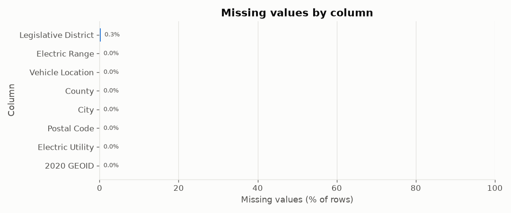
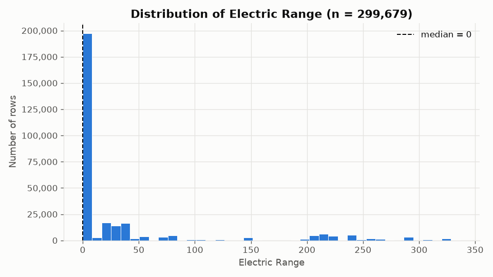
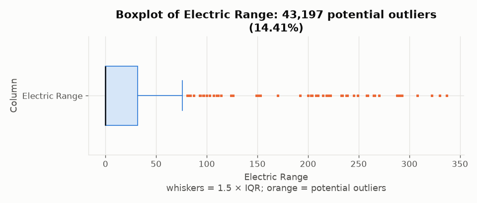
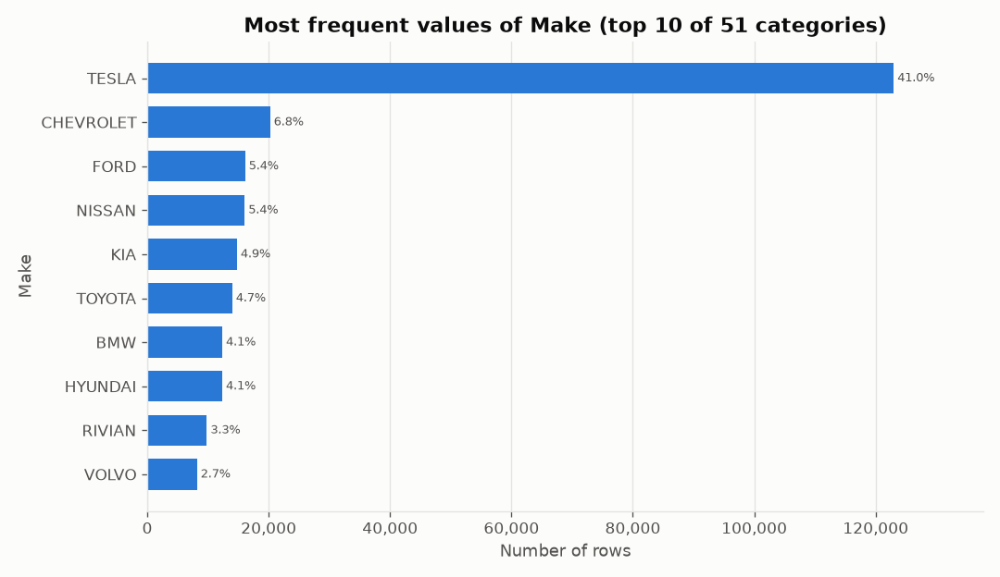
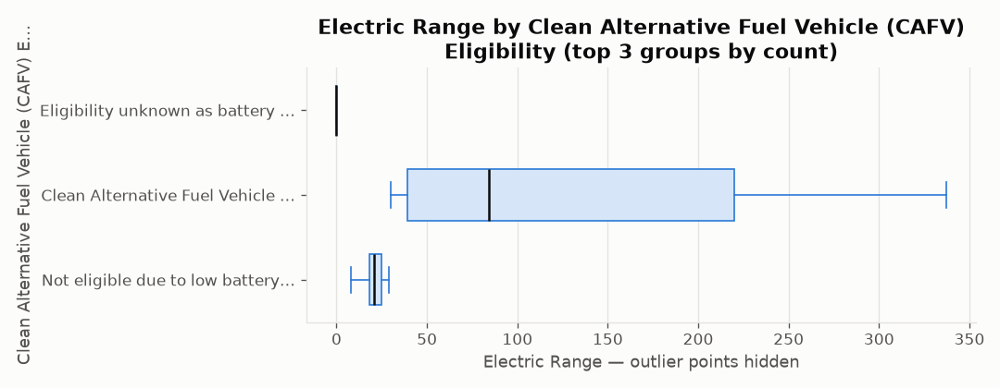
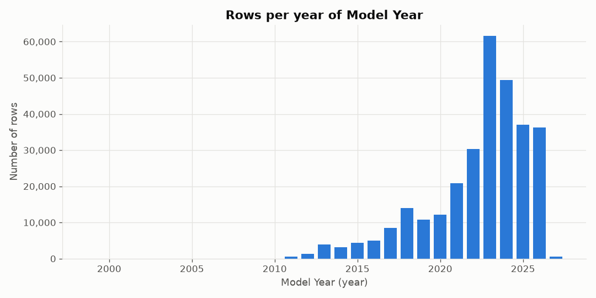
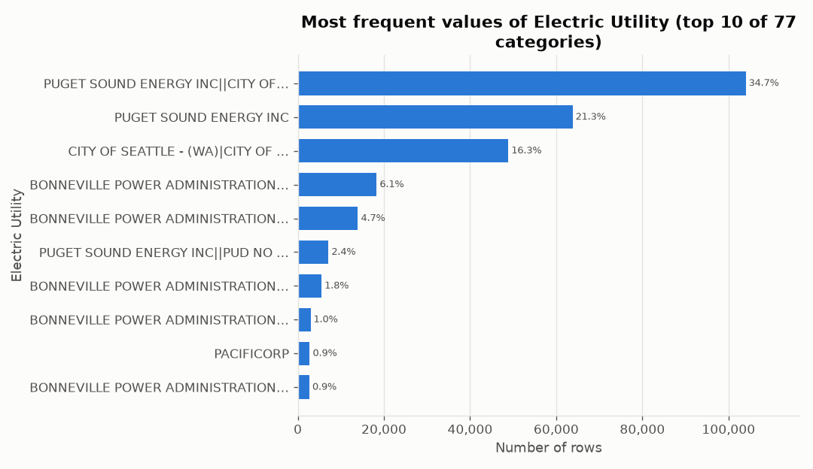

# Automated Data Profile: `wa_electric_vehicle_population.csv`

*Generated by `profiler.py` on 2026-09-23 16:10:47. All statistics were computed in Python (pandas/NumPy); the language model only explains them.*

**AI narrative:** generated with local Ollama model `qwen2.5:7b`; 5 of 6 model insights passed Python verification.

## 1. Dataset overview

- **File:** `wa_electric_vehicle_population.csv`
- **Rows:** 299,705
- **Columns:** 16
- **Column roles:** Categorical attribute (10), Identifier-like field (4), Date-like field (1), Numeric measure (1)

| Column | Technical type | Probable role | Non-missing | Missing % | Unique | Notes |
|---|---|---|---|---|---|---|
| VIN (1-10) | string | Categorical attribute | 299,705 | 0.0% | 18,376 | name suggests a code; treated as categorical because values repeat |
| County | string | Categorical attribute | 299,694 | 0.0% | 255 |  |
| City | string | Categorical attribute | 299,694 | 0.0% | 941 |  |
| State | string | Categorical attribute | 299,705 | 0.0% | 50 |  |
| Postal Code | integer | Identifier-like field | 299,694 | 0.0% | 1201 | numeric code: column name suggests an identifier/code, so it is not treated as a measurement |
| Model Year | integer | Date-like field | 299,705 | 0.0% | 23 | integer years (name contains a year word and values are 1800-2100) |
| Make | string | Categorical attribute | 299,705 | 0.0% | 51 |  |
| Model | string | Categorical attribute | 299,705 | 0.0% | 202 |  |
| Electric Vehicle Type | string | Categorical attribute | 299,705 | 0.0% | 2 |  |
| Clean Alternative Fuel Vehicle (CAFV) Eligibility | string | Categorical attribute | 299,705 | 0.0% | 3 |  |
| Electric Range | integer | Numeric measure | 299,679 | 0.01% | 117 |  |
| Legislative District | integer | Identifier-like field | 298,915 | 0.26% | 49 | numeric code: column name suggests an identifier/code, so it is not treated as a measurement |
| DOL Vehicle ID | integer | Identifier-like field | 299,705 | 0.0% | 299,705 | numeric code: column name suggests an identifier/code, so it is not treated as a measurement |
| Vehicle Location | string | Categorical attribute | 299,685 | 0.01% | 1199 |  |
| Electric Utility | string | Categorical attribute | 299,694 | 0.0% | 77 |  |
| 2020 GEOID | integer | Identifier-like field | 299,694 | 0.0% | 2466 | numeric code: column name suggests an identifier/code, so it is not treated as a measurement |

*Roles are structural guesses (parse rates, cardinality, text length, generic name hints). The profiler does not know what any column means, its units, or its valid range.*

## 2. Data quality profile

- **Duplicate rows:** 0 (0.0%)
- **Missing cells:** 891 (0.02% of all cells); rows with any missing value: 825 (0.28%)
- **Constant columns (one distinct value):** none
- **Completely empty columns:** none
- **High-missingness threshold:** 30% of rows

No column exceeds the high-missingness threshold.

**Mixed / inconsistent types**

None detected.

**Identifier-like or high-cardinality columns**

| Column | Role | Unique values | Unique / non-missing |
|---|---|---|---|
| VIN (1-10) | Categorical attribute | 18,376 | 0.0613 |
| County | Categorical attribute | 255 | 0.0009 |
| City | Categorical attribute | 941 | 0.0031 |
| Postal Code | Identifier-like field | 1201 | 0.004 |
| Make | Categorical attribute | 51 | 0.0002 |
| Model | Categorical attribute | 202 | 0.0007 |
| Legislative District | Identifier-like field | 49 | 0.0002 |
| DOL Vehicle ID | Identifier-like field | 299,705 | 1.0 |
| Vehicle Location | Categorical attribute | 1199 | 0.004 |
| Electric Utility | Categorical attribute | 77 | 0.0003 |
| 2020 GEOID | Identifier-like field | 2466 | 0.0082 |

**Possible placeholder values** (text such as `unknown`, `N/A`, `-999` that may mean missing; *not* converted)

None detected.

**Potentially sensitive fields (heuristic)**

| Column | Why flagged |
|---|---|
| VIN (1-10) | vehicle identifier |
| Postal Code | postal code |
| Vehicle Location | location; values look like geographic point (100% of sampled values) |

> ⚠️ Sensitive-field detection is a heuristic based on column names and a few value patterns. The absence of a warning does **not** mean the dataset is free of personal or sensitive information.

> Nothing was deleted, imputed or corrected: duplicates, missing values and outliers are flagged only.

## 3. Descriptive statistics

### 3.1 Numeric columns

| Column | Valid | Missing | Min | Max | Mean | Median | Mode | Std | Q1 | Q3 | IQR | Outliers (1.5×IQR) |
|---|---|---|---|---|---|---|---|---|---|---|---|---|
| Electric Range | 299,679 | 26 (0.01%) | 0 | 337 | 36.66 | 0 | 0 (×196,235) | 76.03 | 0 | 32 | 32 | 43,197 (14.41%) |

*Std is the sample standard deviation (ddof = 1). Quartiles use linear interpolation. Outliers are values below Q1 − 1.5×IQR or above Q3 + 1.5×IQR; they are potential outliers to review, not errors, and were not removed. Mode is shown only when a value repeats and most values are not unique.*

**Columns where 30% or more of values are exactly 0** (could be real zeros or placeholders): `Electric Range`: 196,235 zeros (65.48%)

### 3.2 Categorical and Boolean columns

**`VIN (1-10)`** (Categorical attribute) — 18,376 distinct values, 299,705 non-missing, 0.0% missing. Most frequent: 7SAYGDEE7P (1228 rows).

| Value | Count | % of non-missing |
|---|---|---|
| 7SAYGDEE7P | 1228 | 0.41% |
| 7SAYGDEE6P | 1219 | 0.41% |
| 7SAYGDEE9T | 1207 | 0.4% |
| 7SAYGDEE1T | 1186 | 0.4% |
| 7SAYGDEE4T | 1181 | 0.39% |
| 7SAYGDEEXT | 1179 | 0.39% |
| 7SAYGDEE0T | 1177 | 0.39% |
| 7SAYGDEE8P | 1177 | 0.39% |
| 7SAYGDEE5P | 1176 | 0.39% |
| 7SAYGDEEXP | 1175 | 0.39% |
| (all other 18,366 values) | 287,800 | 96.03% |

**`County`** (Categorical attribute) — 255 distinct values, 299,694 non-missing, 0.0% missing. Most frequent: King (144,257 rows).

| Value | Count | % of non-missing |
|---|---|---|
| King | 144,257 | 48.13% |
| Snohomish | 37,818 | 12.62% |
| Pierce | 25,042 | 8.36% |
| Clark | 18,803 | 6.27% |
| Thurston | 10,985 | 3.67% |
| Kitsap | 10,351 | 3.45% |
| Spokane | 8741 | 2.92% |
| Whatcom | 7560 | 2.52% |
| Benton | 4507 | 1.5% |
| Skagit | 3570 | 1.19% |
| (all other 245 values) | 28,060 | 9.36% |

**`City`** (Categorical attribute) — 941 distinct values, 299,694 non-missing, 0.0% missing. Most frequent: Seattle (45,469 rows).

| Value | Count | % of non-missing |
|---|---|---|
| Seattle | 45,469 | 15.17% |
| Bellevue | 14,386 | 4.8% |
| Vancouver | 11,215 | 3.74% |
| Redmond | 10,135 | 3.38% |
| Bothell | 9819 | 3.28% |
| Kirkland | 8487 | 2.83% |
| Sammamish | 8129 | 2.71% |
| Renton | 7897 | 2.64% |
| Olympia | 7016 | 2.34% |
| Tacoma | 6651 | 2.22% |
| (all other 931 values) | 170,490 | 56.89% |

**`State`** (Categorical attribute) — 50 distinct values, 299,705 non-missing, 0.0% missing. Most frequent: WA (298,916 rows).

| Value | Count | % of non-missing |
|---|---|---|
| WA | 298,916 | 99.74% |
| CA | 180 | 0.06% |
| VA | 105 | 0.04% |
| MD | 46 | 0.02% |
| TX | 46 | 0.02% |
| FL | 44 | 0.01% |
| OR | 28 | 0.01% |
| NV | 27 | 0.01% |
| CO | 25 | 0.01% |
| AZ | 25 | 0.01% |
| (all other 40 values) | 263 | 0.09% |

**`Make`** (Categorical attribute) — 51 distinct values, 299,705 non-missing, 0.0% missing. Most frequent: TESLA (122,981 rows).

| Value | Count | % of non-missing |
|---|---|---|
| TESLA | 122,981 | 41.03% |
| CHEVROLET | 20,236 | 6.75% |
| FORD | 16,118 | 5.38% |
| NISSAN | 16,053 | 5.36% |
| KIA | 14,776 | 4.93% |
| TOYOTA | 13,998 | 4.67% |
| BMW | 12,356 | 4.12% |
| HYUNDAI | 12,351 | 4.12% |
| RIVIAN | 9817 | 3.28% |
| VOLVO | 8187 | 2.73% |
| (all other 41 values) | 52,832 | 17.63% |

**`Model`** (Categorical attribute) — 202 distinct values, 299,705 non-missing, 0.0% missing. Most frequent: MODEL Y (66,545 rows).

| Value | Count | % of non-missing |
|---|---|---|
| MODEL Y | 66,545 | 22.2% |
| MODEL 3 | 39,391 | 13.14% |
| LEAF | 13,453 | 4.49% |
| MODEL S | 7873 | 2.63% |
| BOLT EV | 7642 | 2.55% |
| IONIQ 5 | 7531 | 2.51% |
| MODEL X | 7177 | 2.39% |
| MUSTANG MACH-E | 6865 | 2.29% |
| ID.4 | 6337 | 2.11% |
| R1S | 5632 | 1.88% |
| (all other 192 values) | 131,259 | 43.8% |

**`Electric Vehicle Type`** (Categorical attribute) — 2 distinct values, 299,705 non-missing, 0.0% missing. Most frequent: Battery Electric Vehicle (BEV) (241,724 rows).

| Value | Count | % of non-missing |
|---|---|---|
| Battery Electric Vehicle (BEV) | 241,724 | 80.65% |
| Plug-in Hybrid Electric Vehicle (PHEV) | 57,981 | 19.35% |

**`Clean Alternative Fuel Vehicle (CAFV) Eligibility`** (Categorical attribute) — 3 distinct values, 299,705 non-missing, 0.0% missing. Most frequent: Eligibility unknown as battery range has not been researched (196,235 rows).

| Value | Count | % of non-missing |
|---|---|---|
| Eligibility unknown as battery range has not been researched | 196,235 | 65.48% |
| Clean Alternative Fuel Vehicle Eligible | 79,293 | 26.46% |
| Not eligible due to low battery range | 24,177 | 8.07% |

**`Vehicle Location`** (Categorical attribute) — 1199 distinct values, 299,685 non-missing, 0.01% missing. Most frequent: POINT (-122.13158 47.67858) (7155 rows).

| Value | Count | % of non-missing |
|---|---|---|
| POINT (-122.13158 47.67858) | 7155 | 2.39% |
| POINT (-122.20105 47.84423) | 5739 | 1.92% |
| POINT (-122.2066 47.67887) | 4816 | 1.61% |
| POINT (-122.12096 47.55584) | 4629 | 1.54% |
| POINT (-122.1872 47.61001) | 4204 | 1.4% |
| POINT (-122.3185 47.67949) | 4168 | 1.39% |
| POINT (-122.03133 47.62858) | 3843 | 1.28% |
| POINT (-122.20928 47.71124) | 3771 | 1.26% |
| POINT (-122.15545 47.75448) | 3757 | 1.25% |
| POINT (-122.21238 47.57816) | 3332 | 1.11% |
| (all other 1189 values) | 254,271 | 84.85% |

**`Electric Utility`** (Categorical attribute) — 77 distinct values, 299,694 non-missing, 0.0% missing. Most frequent: PUGET SOUND ENERGY INC||CITY OF TACOMA - (WA) (103,988 rows).

| Value | Count | % of non-missing |
|---|---|---|
| PUGET SOUND ENERGY INC\|\|CITY OF TACOMA - (WA) | 103,988 | 34.7% |
| PUGET SOUND ENERGY INC | 63,791 | 21.29% |
| CITY OF SEATTLE - (WA)\|CITY OF TACOMA - (WA) | 48,888 | 16.31% |
| BONNEVILLE POWER ADMINISTRATION\|\|PUD NO 1 OF CLARK COUNTY - (WA) | 18,318 | 6.11% |
| BONNEVILLE POWER ADMINISTRATION\|\|CITY OF TACOMA - (WA)\|\|PENINSULA LIGHT COMPANY | 13,964 | 4.66% |
| PUGET SOUND ENERGY INC\|\|PUD NO 1 OF WHATCOM COUNTY | 7120 | 2.38% |
| BONNEVILLE POWER ADMINISTRATION\|\|AVISTA CORP\|\|INLAND POWER & LIGHT COMPANY | 5515 | 1.84% |
| BONNEVILLE POWER ADMINISTRATION\|\|PUD 1 OF SNOHOMISH COUNTY | 2959 | 0.99% |
| PACIFICORP | 2773 | 0.93% |
| BONNEVILLE POWER ADMINISTRATION\|\|PUD NO 1 OF BENTON COUNTY | 2684 | 0.9% |
| (all other 67 values) | 29,694 | 9.91% |

### 3.3 Date-like columns

| Column | Valid | Missing % | Earliest | Latest | Granularity used |
|---|---|---|---|---|---|
| Model Year | 299,705 | 0.0% | 1999 | 2027 | year |

### 3.4 Columns not summarized statistically

| Column | Role | Why |
|---|---|---|
| Postal Code | Identifier-like field | identifiers/free text/mixed values are profiled for quality only |
| Legislative District | Identifier-like field | identifiers/free text/mixed values are profiled for quality only |
| DOL Vehicle ID | Identifier-like field | identifiers/free text/mixed values are profiled for quality only |
| 2020 GEOID | Identifier-like field | identifiers/free text/mixed values are profiled for quality only |

## 4. Relationships between variables

*Skipped: correlation analysis needs at least 2 numeric measure columns; found 1.*

**`Electric Range` by `Clean Alternative Fuel Vehicle (CAFV) Eligibility`** (top groups by count)

| Group | Rows | Median | Mean |
|---|---|---|---|
| Clean Alternative Fuel Vehicle Eligible | 79,267 | 84 | 132.3 |
| Not eligible due to low battery range | 24,177 | 21 | 20.72 |
| Eligibility unknown as battery range has not been researched | 196,235 | 0 | 0 |

## 5. Visualizations

**Figure 1. Missing-value bar chart** — chosen because it shows which columns are incomplete.

**Figure 2. Histogram of Electric Range** — chosen because it shows the shape and skew of the most complete continuous measure.

**Figure 3. Boxplot of Electric Range** — chosen because it shows the median, IQR and 1.5×IQR potential outliers.

**Figure 4. Frequency of Make** — chosen because it shows how rows are spread across categories.

**Figure 5. Electric Range by Clean Alternative Fuel Vehicle (CAFV) Eligibility** — chosen because it shows how a numeric measure differs across categories.

**Figure 6. Rows over time (Model Year)** — chosen because it shows how many rows fall in each time period (temporal coverage).

**Figure 7. Frequency of Electric Utility** — chosen because it shows frequencies for a second categorical column.

**Plot types skipped**

| Plot | Reason |
|---|---|
| Correlation heatmap | correlation analysis needs at least 2 numeric measure columns; found 1 |
| Scatterplot | no pair of numeric measures with enough overlapping values |

## 6. Evidence-based insights

Each insight cites fact IDs from `analysis_summary.json → llm_facts`. Every number in an insight was checked by Python against those facts before it was included.

1. **[data quality]** There are no fully duplicated rows, indicating data integrity (F3).  
   *Evidence: F3 · Source: LLM, verified*
2. **[distribution]** The `Electric Range` column has a high proportion of zeros (65.48%), which could indicate missing or 'not recorded' data (F9).  
   *Evidence: F9 · Source: LLM, verified*
3. **[categorical]** The `Make` column is dominated by a few manufacturers, with Tesla being the most frequent (41.03%) (F10).  
   *Evidence: F10 · Source: LLM, verified*
4. **[limitation]** The column meanings and units are not documented, making it difficult to interpret the data (F19).  
   *Evidence: F19 · Source: LLM, verified*
5. **[follow-up question]** It would be useful to investigate why `Electric Range` has so many zeros and what they represent (F9).  
   *Evidence: F9 · Source: LLM, verified*

### Claim-verification table (all model insights)

| # | Category | Model insight | Cited facts | Supporting statistic (computed by Python) | Status | Checks |
|---|---|---|---|---|---|---|
| 1 | data quality | There are no fully duplicated rows, indicating data integrity (F3). | F3 | F3: There are 0 fully duplicated rows (0.0% of rows). | VERIFIED | all numbers match cited facts |
| 2 | distribution | The `Electric Range` column has a high proportion of zeros (65.48%), which could indicate missing or 'not recorded' data (F9). | F9 | F9: `Electric Range` is exactly 0 in 196,235 rows (65.48% of valid values); zeros could be real or could stand for 'not recorded'. | VERIFIED | all numbers match cited facts |
| 3 | categorical | The `Make` column is dominated by a few manufacturers, with Tesla being the most frequent (41.03%) (F10). | F10 | F10: `Make` has 51 distinct values; most frequent: TESLA = 122,981 (41.03%); CHEVROLET = 20,236 (6.75%); FORD = 16,118 (5.38%); NISSAN = 16,053 (5.36%). | VERIFIED | all numbers match cited facts |
| 4 | limitation | The column meanings and units are not documented, making it difficult to interpret the data (F19). | F19 | F19: Column meanings, units and valid ranges are not documented in the CSV; the profiler infers structure only, not meaning. | VERIFIED | all numbers match cited facts |
| 5 | follow-up question | It would be useful to investigate why `Electric Range` has so many zeros and what they represent (F9). | F9 | F9: `Electric Range` is exactly 0 in 196,235 rows (65.48% of valid values); zeros could be real or could stand for 'not recorded'. | VERIFIED | all numbers match cited facts |
| 6 | categorical | The `Clean Alternative Fuel Vehicle (CAFV) Eligibility` column shows that the majority of vehicles are not eligible due to low battery range (8.07%) (F12). | F12 | F12: `Clean Alternative Fuel Vehicle (CAFV) Eligibility` has 3 distinct values; most frequent: Eligibility unknown as battery range has not been researched = 196,235 (65.48%); Clean Alternative Fuel Vehicle Eligible = 79 | REJECTED | says 'majority' but the percentage given is 8.07% |

REJECTED insights are left out of the list above. At most 2 verified model insights per category are used; Python template insights fill any required category the model did not cover.

## 7. Skipped analyses and limitations

- Skipped: correlation analysis needs at least 2 numeric measure columns; found 1
- Types and roles are inferred from values and generic name hints; they can be wrong for unusual columns.
- Column meanings, units and valid ranges are undocumented in a bare CSV and are not interpreted.
- Outliers use the 1.5×IQR rule, which flags many points in skewed distributions; flagged values are not necessarily errors.
- Pearson correlation captures only linear association and is sensitive to outliers; no correlation implies causation.
- Sensitive-field detection is a heuristic; no warning does not mean the data are safe.
- Placeholder values (e.g. 'unknown', -999) are flagged but not converted unless listed in config.missing_codes.

## 8. Files produced

- `report.md` (this file), `column_profile.csv`, `analysis_summary.json`, `llm_prompt.txt`, `llm_response.txt`, and `plots/`.
